Applied Data Science
========================================================
author: Visualization with ggplot
date: 18.03.2019
autosize: false
width: 1920
height: 1080
font-family: 'Arial'
css: mySlideTemplate.css


<footer class = 'footnote'>
<div style="position: absolute; left: 0px; bottom: 50px; z-index:100; background-color:white">
Prof. Dr. Christoph Flath</div>
</footer>
<footer class = 'logo'>
<div style="position: absolute; left: 1100px; bottom: 25px; z-index:100; background-color:white">

</div>
</footer>


ggplot2 - A grammar for graphics
===============

* `ggplot2` is a system for declaratively creating graphics, based on The Grammar of Graphics
* You provide the data, tell ggplot2 how to map variables to aesthetics, what graphical primitives to use, and it takes care of the details
* Helpful resources

    * By far the best and most illustrative http://www.cookbook-r.com/Graphs/

    * Official Website http://ggplot2.org/

    * Another Tutorial http://r-statistics.co/ggplot2-Tutorial-With-R.html


***

* It’s hard to succinctly describe how ggplot2 works because it embodies a deep philosophy of visualisation
* However, in most cases you start with `ggplot()`, supply a dataset and aesthetic mapping (with `aes()`)
* You then add on layers (like `geom_point()` or `geom_histogram()`)
* Subsequently you may want to add additional elemnts like scales (like `scale_colour_brewer()`), faceting specifications (like `facet_wrap()`) and coordinate systems (like `coord_flip()`)


Our first ggplot2 visualization
========================================================


```r
require(tidyverse) #as always


str(mpg)  #ggplot‘s car data set
```

```
Classes 'tbl_df', 'tbl' and 'data.frame':	234 obs. of  11 variables:
 $ manufacturer: chr  "audi" "audi" "audi" "audi" ...
 $ model       : chr  "a4" "a4" "a4" "a4" ...
 $ displ       : num  1.8 1.8 2 2 2.8 2.8 3.1 1.8 1.8 2 ...
 $ year        : int  1999 1999 2008 2008 1999 1999 2008 1999 1999 2008 ...
 $ cyl         : int  4 4 4 4 6 6 6 4 4 4 ...
 $ trans       : chr  "auto(l5)" "manual(m5)" "manual(m6)" "auto(av)" ...
 $ drv         : chr  "f" "f" "f" "f" ...
 $ cty         : int  18 21 20 21 16 18 18 18 16 20 ...
 $ hwy         : int  29 29 31 30 26 26 27 26 25 28 ...
 $ fl          : chr  "p" "p" "p" "p" ...
 $ class       : chr  "compact" "compact" "compact" "compact" ...
```

***


```r
g = ggplot(mpg, aes(x=displ, y=cty))
g = g + geom_point()
g
```

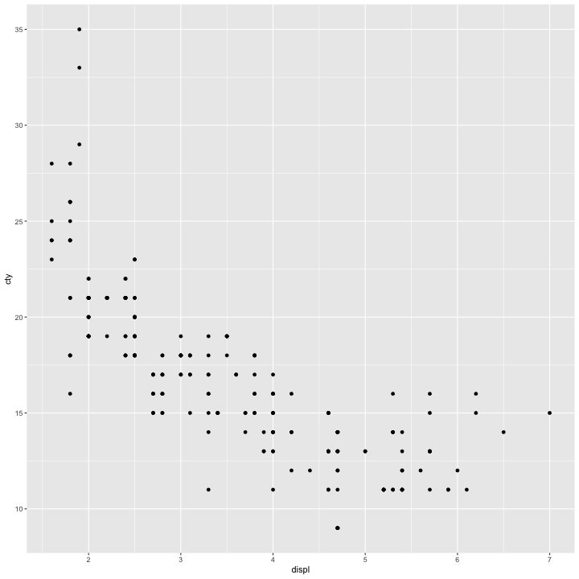

Refining g
==========


```r
g2 = ggplot(mpg, aes(x=displ,y=cty))
g2 = g2 + geom_point(size=2, shape=4)
g2 = g2 + ylab("mpg (City)") + xlab("Displacement")
g2 = g2 + labs(title = "Fuel Efficiency",
		   subtitle = "(urban driving)",
		   caption = "Source: ggplot::mpg")
g2 = g2 + geom_smooth(se = FALSE, method = "lm")
#g2 = g2 + geom_smooth()
```

***


```r
g2
```

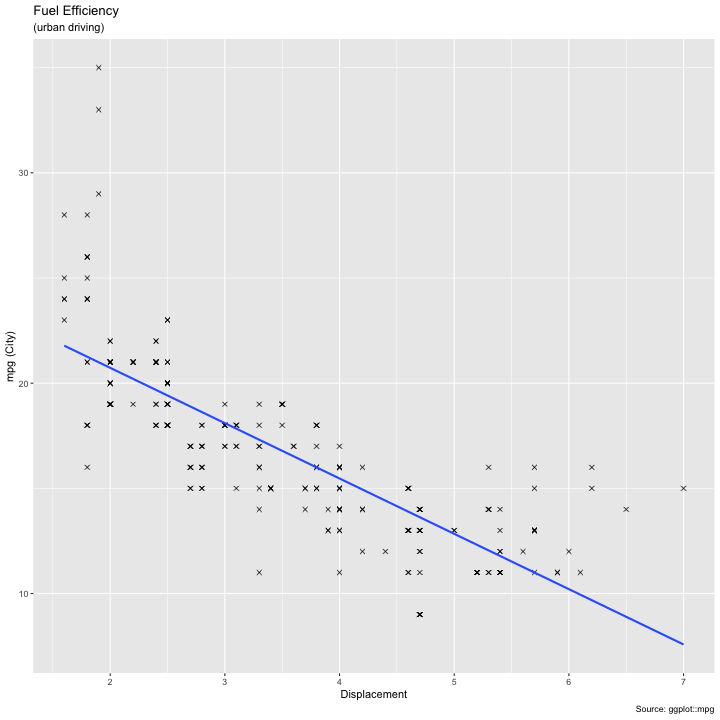


Your turn
=========

* Run `ggplot(data = mpg)`. What do you see? Why?
* How many rows are in mpg? How many columns?
* Make a scatterplot of `hwy` vs `cyl`.
* What happens if you make a scatterplot of class vs drv? Why is the plot not useful?


Histograms
=======


```r
g = ggplot(mpg, aes(x=cty))
g = g + geom_histogram(fill="white",color="black")
g
```

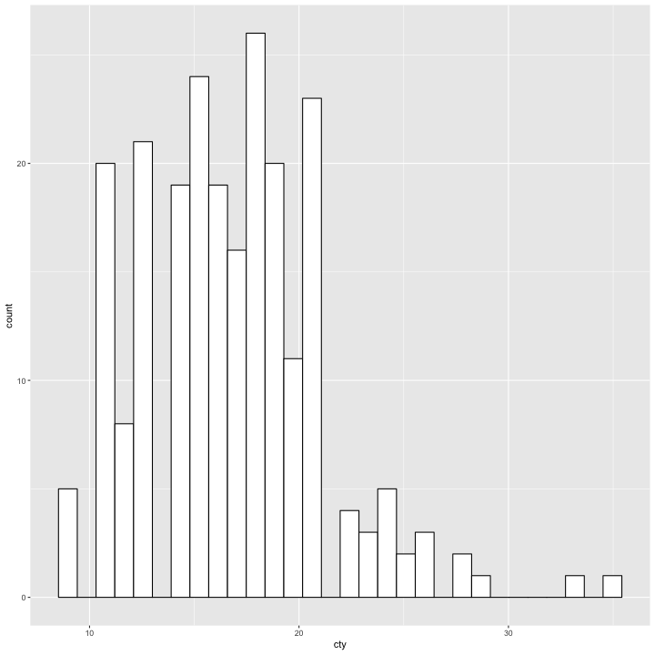

***


```r
g = ggplot(mpg, aes(x=cty))
g = g + geom_histogram(fill="white",color="black", bins=10)
g
```

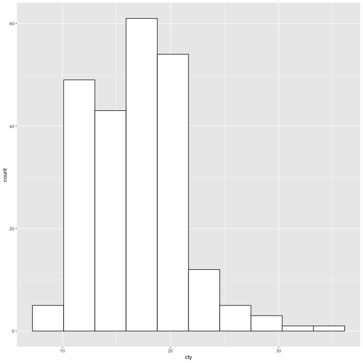

Boxplot and Violin Plots
======


```r
g = ggplot(mpg, aes(x=1,y=cty)) 
g = g + geom_boxplot() 
g
```

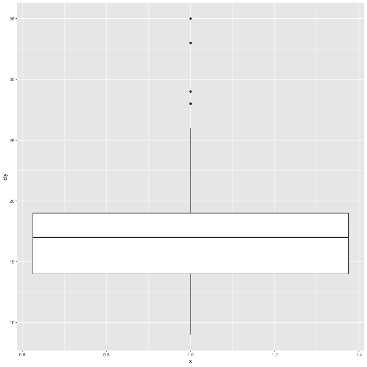

***


```r
g = ggplot(mpg, aes(x=1,y=cty)) 
g = g + geom_violin()
g
```


Boxplot and Violin Plots (2)
======


```r
g = ggplot(mpg, aes(x=class,y=cty)) 
g = g + geom_boxplot() 
g
```

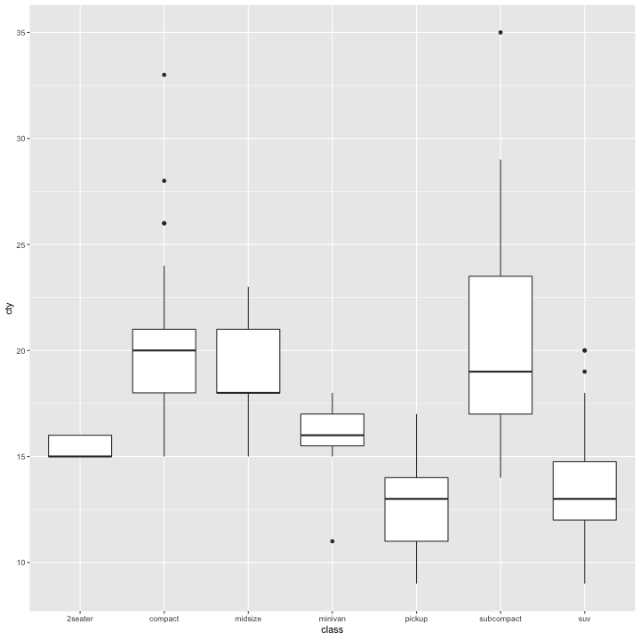

***


```r
g = ggplot(mpg, aes(x=class,y=cty)) 
g = g + geom_violin() 
g
```

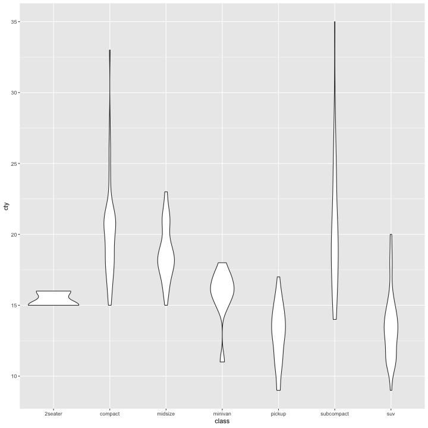

Bars and Columns
====


```r
mpg %>%
  group_by(class) %>%
  summarize(mpg=mean(cty)) %>%
  ggplot(.,aes(y=mpg,x=class)) + geom_col()
```


***


```r
mpg %>%
  group_by(class) %>%
  summarize(mpg=mean(cty)) %>%
  ggplot(.,aes(y=mpg,x=class)) + geom_col() + coord_flip()
```


Bars and Columns
====


```r
g = ggplot(mpg, aes(x=as.factor(cyl),fill=class))
g = g + geom_bar(position = "fill")
g = g + scale_fill_brewer(palette="Paired")
g
```

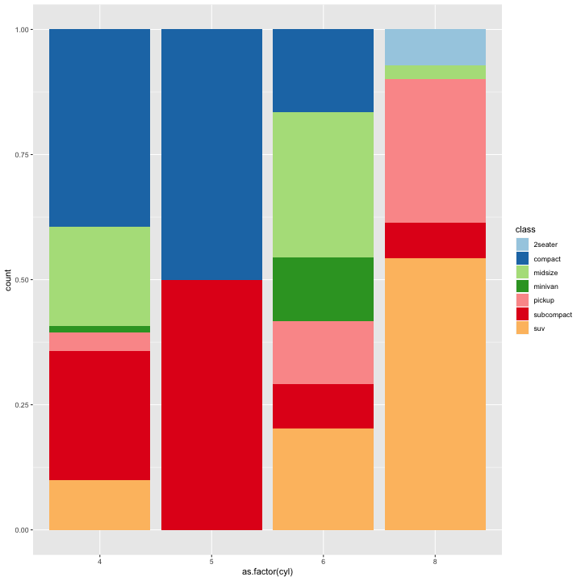

***


```r
g = ggplot(mpg, aes(x=1,fill=class))
g = g + geom_bar(position = "fill")
g = g + scale_fill_brewer(palette="Paired")
g = g + coord_polar("y", start = 0) 
g = g + facet_wrap(.~cyl)
g
```

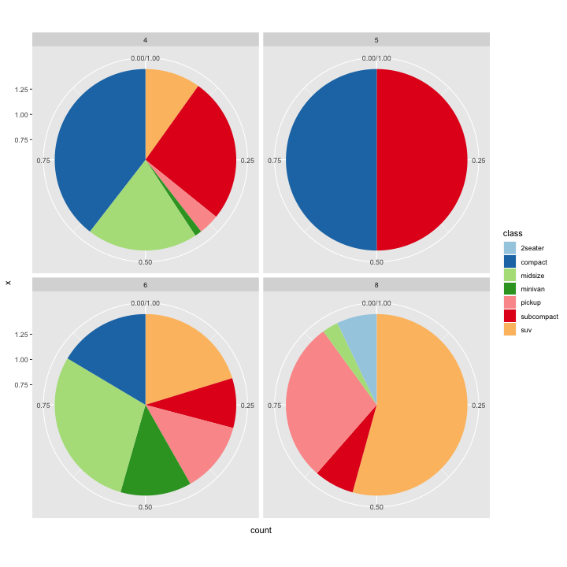


Line Charts
=====


```r
require(datasets)
pass = data.frame(passengers=as.numeric(AirPassengers))
pass$year = rep(1949:1960,each=12)
pass$month = rep(1:12,12)
pass$date = paste0(pass$year,pass$month)
pass$date = lubridate::parse_date_time(pass$date,"Ym")
g = ggplot(pass,aes(x=date,y=passengers))
g = g + geom_line() 
g = g + geom_smooth()
g = g + ylim(0,750)
g
```

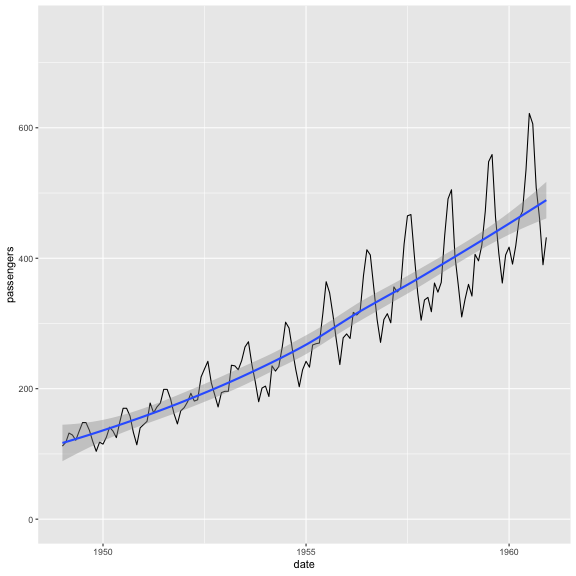

***


```r
require(datasets)
g = ggplot(pass,aes(x=date,y=passengers))
g = g + geom_step()
g = g + geom_smooth()
g = g + ylim(0,750)
g
```


Your turn
=====


* Compare and contrast `geom_jitter()` with `geom_count()`.

* What does the plot below tell you about the relationship between city and highway mpg? Why is `coord_fixed()` important?
* What does `geom_abline()` do? Explore its syntax and include lines for `mean(mpg$cty)` and `mean(mpg$hwy)`.


```r
ggplot(mpg, aes(x = cty, y = hwy)) + geom_point() + 
geom_abline() + ylim(0,50) + xlim(0,40) +
coord_fixed()
```


Going beyond standard graphics
=====

* So far we used ggplot just to single plots of complete data sets
* However, ggplot is at its best when leveraging meta information embedded in the data
* By means of aesthetics mappings we will format and plot display conditional on data entries
* Aesthetics defined in the initial ggplot object are applied to all layers
* Aesthetics defined in a specific layer are only valid for the current layer


Dynamic aesthetics
======


```r
g = ggplot(mpg ,aes(x=displ,y=cty))
g = g + geom_point(aes(color=class),size=4)
g = g + ylim(0,40)
g
```


***


```r
g = ggplot(filter(mpg,class!="2seater"),aes(x=displ,y=cty))
g = g + geom_point(aes(shape=class),size=4)
g = g + ylim(0,40)
g
```


Excursus: Tidying Data
=====

* Often we encounter data sets where similar variables are spread across variables
* This makes it hard to leverage aesthetics
* Example:


```r
hsb2 <- read.table('http://stats.idre.ucla.edu/stat/r/faq/hsb2.csv', header=T, sep=",")
head(hsb2,10)
```

```
    id female race ses schtyp prog read write math science socst
1   70      0    4   1      1    1   57    52   41      47    57
2  121      1    4   2      1    3   68    59   53      63    61
3   86      0    4   3      1    1   44    33   54      58    31
4  141      0    4   3      1    3   63    44   47      53    56
5  172      0    4   2      1    2   47    52   57      53    61
6  113      0    4   2      1    2   44    52   51      63    61
7   50      0    3   2      1    1   50    59   42      53    61
8   11      0    1   2      1    2   34    46   45      39    36
9   84      0    4   2      1    1   63    57   54      58    51
10  48      0    3   2      1    2   57    55   52      50    51
```

The gather command
======


```r
hsb2 %>%
  gather(subject, score, 7:11) %>%
  arrange(id) %>%
  head(10)
```

```
   id female race ses schtyp prog subject score
1   1      1    1   1      1    3    read    34
2   1      1    1   1      1    3   write    44
3   1      1    1   1      1    3    math    40
4   1      1    1   1      1    3 science    39
5   1      1    1   1      1    3   socst    41
6   2      1    1   2      1    3    read    39
7   2      1    1   2      1    3   write    41
8   2      1    1   2      1    3    math    33
9   2      1    1   2      1    3 science    42
10  2      1    1   2      1    3   socst    41
```

If data is more complicated identify rows via `match`
=====


```r
cols = match(c("read","write","math","science","socst"),
	    colnames(hsb2))

hsb2 %>%
  gather(subject, score, cols) %>%
  arrange(id) %>%
  head(10)
```

```
   id female race ses schtyp prog subject score
1   1      1    1   1      1    3    read    34
2   1      1    1   1      1    3   write    44
3   1      1    1   1      1    3    math    40
4   1      1    1   1      1    3 science    39
5   1      1    1   1      1    3   socst    41
6   2      1    1   2      1    3    read    39
7   2      1    1   2      1    3   write    41
8   2      1    1   2      1    3    math    33
9   2      1    1   2      1    3 science    42
10  2      1    1   2      1    3   socst    41
```

Example: geom_point with colors / shapes (2)
=====


```r
mpg %>% gather(environment,
               milesPerGallon,
               8:9) %>%
  ggplot(aes(x=displ, y=milesPerGallon)) +
  geom_point(aes(color=environment), size=4)
```

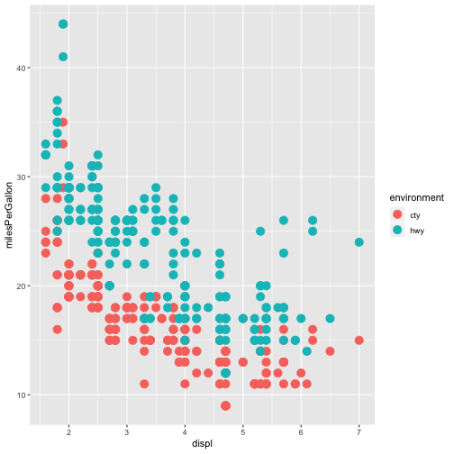

***


```r
g
```


Example: geom_line with linetype
=====


```r
unique(mpg) %>%
  group_by(model,displ,trans,fl) %>%
  filter(n() > 1 & class == "midsize") %>%
  mutate(modelDetailed = paste(model,displ,trans,fl)) %>%
  ggplot(.,aes(x=year,y=cty,group=modelDetailed)) + geom_line(aes(linetype=modelDetailed)) -> g
```

***


```r
g
```


Example: bar colors
======


```r
mpg %>%
  mutate(automatic = grepl("auto",trans)) %>%
  group_by(class,automatic) %>%
  summarize(mpg=mean(cty)) %>%
  filter(n() > 1) %>%
  ggplot(.,aes(y=mpg,x=class,fill=automatic)) + geom_bar(stat="identity",position = "dodge") -> g
```

***


```r
g
```

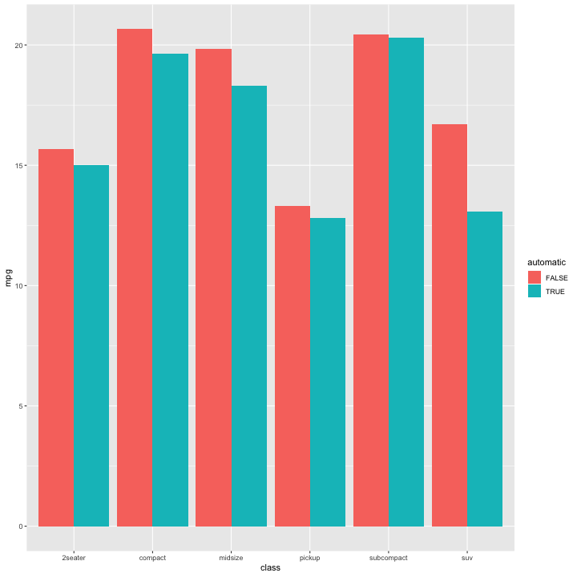

Example: density with fill color
======


```r
g = ggplot(mpg,aes(x=cty))
g = g + geom_density(aes(fill=class),alpha=0.5)
```

***


```r
g
```


Your turn
======

* What’s gone wrong with this code? Why are the points not blue?

```r
ggplot(data = mpg) + geom_point(mapping = aes(x = displ, y = hwy, color = "blue"))
```

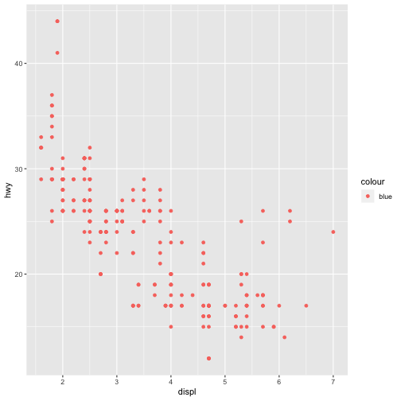
* Recreate the R code necessary to generate the following graphs.

***


Facetting
=======

* Trellis Plots aka Facetting aka Small Multiples
* Overlaps, multiple colors / shapes often can become confusing and to understand
* Separating plots into distinct panel based on categorical variables facilitates a very elegant and distinct style of graphical communication
* With ggplot this is one line of code

facet_wrap by class
======


```r
ggplot(data = mpg) + 
  geom_point(mapping = aes(x = displ, y = hwy)) + 
  facet_wrap(~ class, nrow = 2)
```

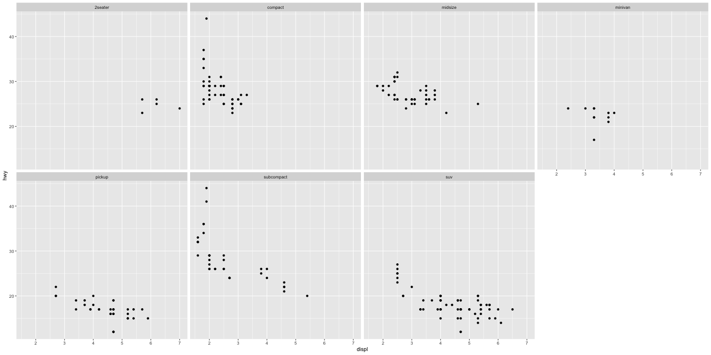

facet_grid transmission
======


```r
mpg %>%
  mutate(automatic = grepl("auto",trans)) %>%
  ggplot(.,aes(x=displ,y=cty)) + geom_point(size=4) + facet_grid(automatic~cyl)
```

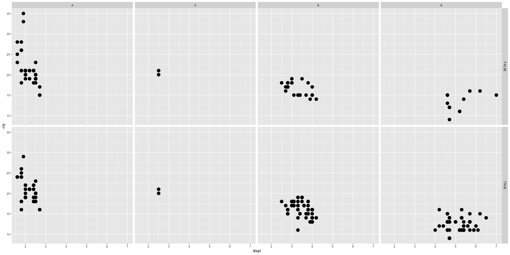

Combining facetting and aesthetics mapping
=======


```r
mpg %>%
  mutate(automatic = grepl("auto",trans)) %>%
  ggplot(.,aes(x=displ,y=cty, color=class)) + geom_point(size=4) + facet_grid(automatic~cyl)
```

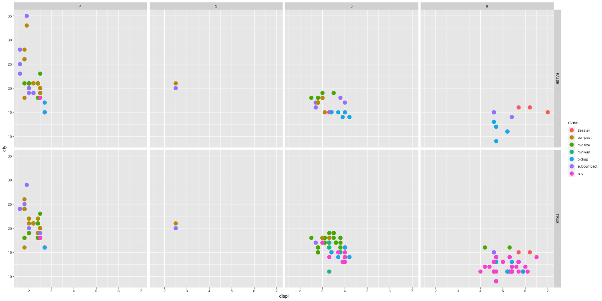


Your turn
======

* What are the advantages to using faceting instead of the colour aesthetic? What are the disadvantages? How might the balance change if you had a larger dataset?

* Read `?facet_wrap`. What does nrow do? What does ncol do? What other options control the layout of the individual panels? Why doesn’t `facet_grid()` have `nrow` and `ncol` argument?

* When using `facet_grid()` you should usually put the variable with more unique levels in the columns. Why?


