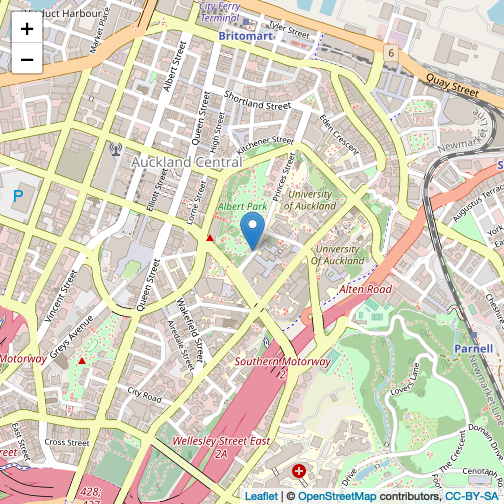
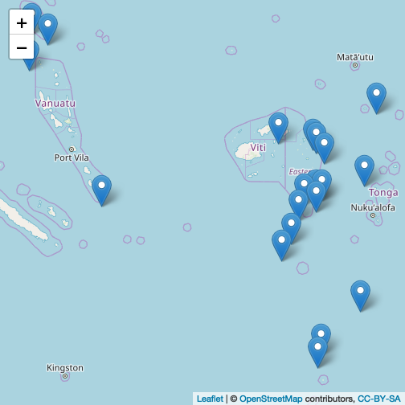
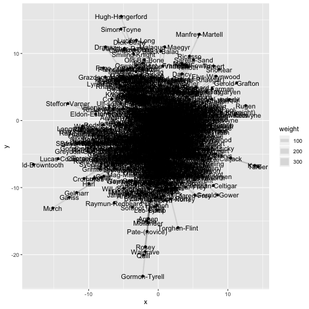
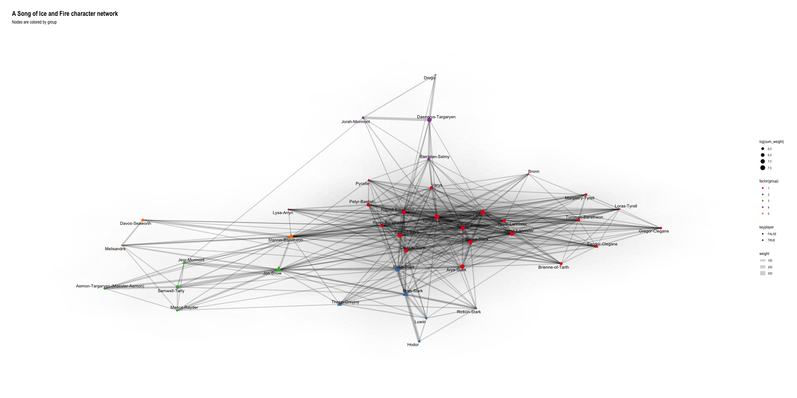
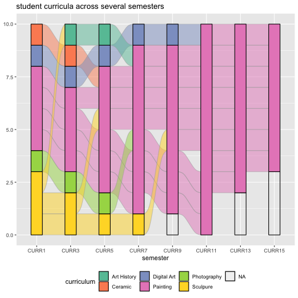
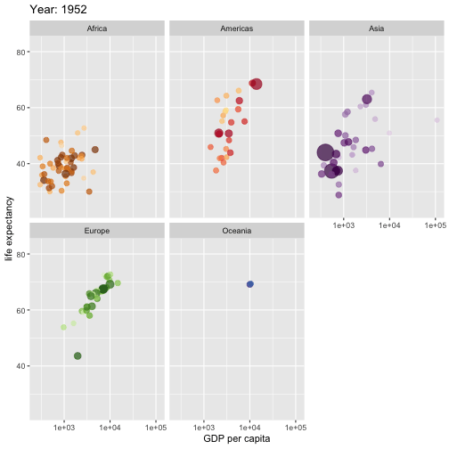

Applied Data Science
========================================================
author: Advanced Visualization Topics
date: 18.03.2019
autosize: false
width: 1920
height: 1080
font-family: 'Arial'
css: mySlideTemplate.css

esquisse: Simplifying ggplot2
========================================================


***

`library(esquisse)`

`esquisser()`

> The purpose of this add-in is to let you explore your data quickly to extract the information they hold.

R Journalism - a very nice website
=====

https://learn.r-journalism.com/en/

The Leaflet Package
======
* Leaflet is the leading open-source JavaScript library for mobile-friendly interactive maps.
* Leaflet is designed with simplicity, performance and usability in mind.
* It works efficiently across all major desktop and mobile platforms, can be extended with lots of plugins
* It has a beautiful, easy to use and well-documented API and a simple, readable source code that is a joy to contribute to.

***


Leaflet for R
=====

* https://rstudio.github.io/leaflet/


```r
library(leaflet)
leaflet() %>%
  addTiles() %>%  # Add default OpenStreetMap map tiles
  addMarkers(lng=174.768, lat=-36.852, popup="The birthplace of R") -> m
```
***

```r
m
```



Multiple Markers
=====

```r
data(quakes)

leaflet(data = quakes[1:20,]) %>%
addTiles() %>%
  addMarkers(~long, ~lat, popup = ~as.character(mag)) -> m
```

***


```r
m
```




Choropleth
====

* Let me Wikipedia this for you:

> A choropleth map (from Greek χῶρος ("area/region") + πλῆθος ("multitude")) is a thematic map in which areas are shaded or patterned in proportion to the measurement of the statistical variable being displayed on the map, such as population density or per-capita income.

Granularity is key
=====


Geometry
====

* The key ingredient for a chloropleth is the geometry on which the data is to be projected

* https://gadm.org/ is an amazing source for so-called SpatialPolygonsDataFrames (`sp`) for different administrative Boundaries

* https://gadm.org/download_country_v3.html


***

* ggplot does not speak sp right away

    * As we are well aware ggplot expects a data frame as the data source

    * This geometry data frame can be obtained via "fortifying" of the sp object
    
Fortifying    
====


```r
library(rgeos)
library(broom)
library(maptools)
library(tidyverse)
library(sp)
gadm36_DEU_1_sp = readRDS(gzcon(url("https://biogeo.ucdavis.edu/data/gadm3.6/Rsp/gadm36_DEU_1_sp.rds")))
mapdata = fortify(gadm36_DEU_1_sp, "NAME_1")
```

***


```r
glimpse(mapdata)
```


Now we can plot a map (boring?)
====


```r
mapdata %>% 
ggplot() +
geom_polygon(aes(x=long, y=lat, fill = id, group=group))
```

***


```r
mapdata %>% 
ggplot() +
geom_polygon(aes(x=long, y=lat, fill = id))
```


Programming Task
=====

* Get the car registration data on Laender level from https://www.kba.de/DE/Statistik/Fahrzeuge/Neuzulassungen/Umwelt/2016/2016_n_umwelt_dusl.html?nn=1978302

* Use it to create a proper chloropleth!


Leaflet again
====

* Getting most things done by somebody else


```r
library(leaflet)
library(raster)

#get GADM data
usa <- getData("GADM", country="USA", level=1)
usa$randomData <- rnorm(n=nrow(usa), 150, 30)

#create a color palette to fill the polygons
pal <- colorQuantile("Greens", NULL, n = 5)

#create a pop up (onClick)
polygon_popup <- paste0("<strong>Name: </strong>", usa$NAME_1, "<br>",
                        "<strong>Indicator: </strong>", round(usa$randomData,2))

#create leaflet map
leaflet() %>% 
  addProviderTiles("CartoDB.Positron") %>% 
  setView(-98.35, 39.7,
          zoom = 4) %>% 
  addPolygons(data = usa, 
              fillColor= ~pal(randomData),
              fillOpacity = 0.4, 
              weight = 2, 
              color = "white",
              popup = polygon_popup)
```


Network Visualization
=====

* Key ingredients
    * Vertices
    * Edges + Weights

* Typically provided as Edgelist  easily created with dplyr pipelines adjacency matrix

* Useful for visualizations of social or technical systems


***

* The classic and cross-platform quasi standard: igraph

* Many different packages available for the ggplot environment
    * https://journal.r-project.org/archive/2017/RJ-2017-023/RJ-2017-023.pdf 
    * ggnet
    * ggnetwork
    * ggraph

* We will look into ggraph / tidyraph
    * https://cran.r-project.org/web/packages/ggraph/index.html
    
Why visualize networks ?
====


Network design elements
====
 

Layout options
====
 
    
A (not so) minimal first example
====

Getting Data


```r
library(tidygraph)
library(tidyverse)
library(ggraph)
library(RCurl)
x <- getURL("https://raw.githubusercontent.com/mathbeveridge/asoiaf/master/data/asoiaf-all-edges.csv")
y <- read.csv(text = x)
```
***
Creating Network


```r
y %>%
  as_tbl_graph(directed = F) %>%
  ggraph() + 
  geom_edge_link(aes(width = weight), alpha = 0.1) + 
  geom_node_point() +
  geom_node_text(aes(label = name)) 
```



Getting to Work
====


```r
y %>%
  select(-Type) %>%
  gather(x, name, Source:Target) %>%
  group_by(name) %>%
  summarise(sum_weight = sum(weight)) %>%
  ungroup() -> main_ch

main_ch %>%
  arrange(desc(sum_weight)) %>%
  top_n(40, sum_weight) -> main_ch_l
main_ch_l
```

```
# A tibble: 40 x 2
   name               sum_weight
   <chr>                   <int>
 1 Tyrion-Lannister         2873
 2 Jon-Snow                 2757
 3 Cersei-Lannister         2232
 4 Joffrey-Baratheon        1762
 5 Eddard-Stark             1649
 6 Daenerys-Targaryen       1608
 7 Jaime-Lannister          1569
 8 Sansa-Stark              1547
 9 Bran-Stark               1508
10 Robert-Baratheon         1488
# ... with 30 more rows
```

Get some annotation statistics, remove duplicated edges
=====


```r
cooc_all_f <- y %>%
  filter(Source %in% main_ch_l$name & Target %in% main_ch_l$name)

as_tbl_graph(cooc_all_f, directed = FALSE) %>%
  mutate(neighbors = centrality_degree(),
         group = group_infomap(),
         keyplayer = node_is_keyplayer(k = 10)) %>%
  left_join(main_ch_l) %>%
  activate(edges) %>% 
  filter(!edge_is_multiple()) -> cooc_all_f_graph
```

Create Layout, set plot options
====


```r
layout <- create_layout(cooc_all_f_graph, 
                        layout = "fr")

ggraph(layout) + 
  geom_edge_density(aes()) +
  geom_edge_link(aes(width = weight), alpha = 0.2) + 
  geom_node_point(aes(color = factor(group),
		size=log(sum_weight),
		shape=keyplayer)) +
  geom_node_text(aes(label = name), size = 4, repel = TRUE) +
  scale_color_brewer(palette = "Set1") +
  theme_graph() +
  labs(title = "A Song of Ice and Fire character network",
       subtitle = "Nodes are colored by group") -> network
```

Much better
====


```r
network
```




Up to you @ home / tutorial
====

* The following code provides you with Hillary Clinton's infamous "email server data"

* Apply your network visualization skills to this dataset


```r
require(jsonlite)

if (!file.exists("clinton_emails.rda")) {
  clinton_emails <- fromJSON("http://graphics.wsj.com/hillary-clinton-email-documents/api/search.php?subject=&text=&to=&from=&start=&end=&sort=docDate&order=desc&docid=&limit=27159&offset=0")$rows
  save(clinton_emails, file="clinton_emails.rda")
}

load("clinton_emails.rda")
```

Chord Diagrams
====

* Circular plots are useful to represent complicated information.
* They are used in 2 specific cases: 
    * when you have long axis and numerous categories
    * When you want to show relationships between elements

***


Basic example with circlize
====


```r
#Create data
name=c(3,10,10,3,6,7,8,3,6,1,2,2,6,10,2,3,3,10,4,5,9,10)
feature=paste("feature ", c(1,1,2,2,2,2,2,3,3,3,3,3,3,3,4,4,4,4,5,5,5,5) , sep="")
dat <- data.frame(name,feature)
dat <- with(dat, table(name, feature))

# Charge the circlize library
library(circlize)
```

***


```r
# Make the circular plot
chordDiagram(as.data.frame(dat), transparency = 0.5)
```


Sankey Diagrams
====

* A Sankey diagram is a specific type of flow diagram, in which the width of the links is shown proportionally to the flow quantity.
* Entities are represented by rectangles or text, and linked if there is a flow between them.


***


Multiple stages is the key advantage
====


ggalluvial is your friend
====


```r
require(ggalluvial)
data(majors)
majors$curriculum <- as.factor(majors$curriculum)
ggplot(majors,
       aes(x = semester, stratum = curriculum, alluvium = student,
           fill = curriculum, label = curriculum)) +
  scale_fill_brewer(type = "qual", palette = "Set2") +
  geom_flow(stat = "alluvium", lode.guidance = "rightleft",
            color = "darkgray") +
  geom_stratum() +
  theme(legend.position = "bottom") +
  ggtitle("student curricula across several semesters") -> sankey
```

***


```r
sankey
```



Animations and Hans Rosling
====


https://www.youtube.com/watch?v=jbkSRLYSoj


Doing the gapminder with ggplot
====


```r
library(gapminder)
library(ggplot2)
library(gganimate)

ggplot(gapminder, aes(gdpPercap, lifeExp, size = pop, colour = country)) +
  geom_point(alpha = 0.7) +
  scale_colour_manual(values = country_colors) +
  scale_size(range = c(2, 12)) +
  scale_x_log10() +
  facet_wrap(~continent) +
  theme(legend.position = 'none') +
  labs(title = 'Year: {frame_time}', x = 'GDP per capita', y = 'life expectancy') +
  transition_time(year) -> gapanimation
```

***


```r
gapanimation
```


