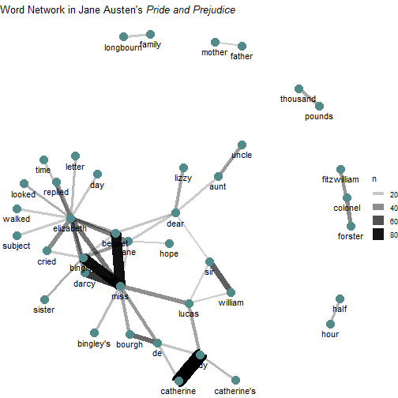
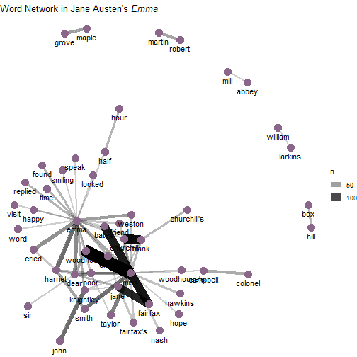

Applied Data Science
========================================================
author: Text Mining
date: 09.07.2019
autosize: false
width: 1920
height: 1080
font-family: 'Arial'
css: mySlideTemplate.css

Credits
======
* The main parts of this lecture and the R examples follow from the fantastic tutorials provided by

* http://juliasilge.com/blog/Life-Changing-Magic/

* http://juliasilge.com/blog/Term-Frequency-tf-idf/

* https://www.tidytextmining.com/index.html

* https://www.hvitfeldt.me/blog/text-classification-with-tidymodels/

The tidytext package
====
As described by Hadley Wickham, `tidy` data has a specific structure:
* each variable is a column
* each observation is a row
* each type of observational unit is a table

The goal of the `tidytext` package is to provide functions and supporting data sets to allow
* conversion of text to and from tidy formats
* to switch seamlessly between tidy tools and existing text mining packages

En passant we benefit from the familiar pipe structure

A first minimal example: Getting all words from Jane Austen's novels
====


```r
original_books <- austen_books() 

original_books
```

```
# A tibble: 73,422 x 2
   text                  book               
 * <chr>                 <fct>              
 1 SENSE AND SENSIBILITY Sense & Sensibility
 2 ""                    Sense & Sensibility
 3 by Jane Austen        Sense & Sensibility
 4 ""                    Sense & Sensibility
 5 (1811)                Sense & Sensibility
 6 ""                    Sense & Sensibility
 7 ""                    Sense & Sensibility
 8 ""                    Sense & Sensibility
 9 ""                    Sense & Sensibility
10 CHAPTER 1             Sense & Sensibility
# ... with 73,412 more rows
```

***


```r
original_books %>%
  unnest_tokens(word, text) -> tidy_books

tidy_books
```

```
# A tibble: 725,055 x 2
   book                word       
   <fct>               <chr>      
 1 Sense & Sensibility sense      
 2 Sense & Sensibility and        
 3 Sense & Sensibility sensibility
 4 Sense & Sensibility by         
 5 Sense & Sensibility jane       
 6 Sense & Sensibility austen     
 7 Sense & Sensibility 1811       
 8 Sense & Sensibility chapter    
 9 Sense & Sensibility 1          
10 Sense & Sensibility the        
# ... with 725,045 more rows
```

Retaining information by annotating beforehand
=====

```r
austen_books() %>%
        group_by(book) %>%
        mutate(linenumber = row_number(),
               chapter = cumsum(str_detect(text,
                                           regex("^chapter [\\divxlc]",                                                 			ignore_case = T)
                                           )
                                )
               ) %>%
        ungroup() -> original_books

head(original_books)
```

```
# A tibble: 6 x 4
  text                  book                linenumber chapter
  <chr>                 <fct>                    <int>   <int>
1 SENSE AND SENSIBILITY Sense & Sensibility          1       0
2 ""                    Sense & Sensibility          2       0
3 by Jane Austen        Sense & Sensibility          3       0
4 ""                    Sense & Sensibility          4       0
5 (1811)                Sense & Sensibility          5       0
6 ""                    Sense & Sensibility          6       0
```

***


```r
original_books %>%
  unnest_tokens(word, text) -> tidy_books

head(tidy_books)
```

```
# A tibble: 6 x 4
  book                linenumber chapter word       
  <fct>                    <int>   <int> <chr>      
1 Sense & Sensibility          1       0 sense      
2 Sense & Sensibility          1       0 and        
3 Sense & Sensibility          1       0 sensibility
4 Sense & Sensibility          3       0 by         
5 Sense & Sensibility          3       0 jane       
6 Sense & Sensibility          3       0 austen     
```

A not so helpful word count
=====


```r
tidy_books %>%
        count(word, sort = TRUE)
```

```
# A tibble: 14,520 x 2
   word      n
   <chr> <int>
 1 the   26351
 2 to    24044
 3 and   22515
 4 of    21178
 5 a     13408
 6 her   13055
 7 i     12006
 8 in    11217
 9 was   11204
10 it    10234
# ... with 14,510 more rows
```

What should we do next?

Stop words to the resuce!
====

* Since the data is in one-word-per-row format, we can just use our `dplyr` skills
* For example, we can remove stop words with an `anti_join`
* tidytext provides `stop_words` for English texts


```r
data("stop_words")
tidy_books %>%
anti_join(stop_words) -> tidy_books
```


***


```r
tidy_books %>%
        count(word, sort = TRUE)
```

```
# A tibble: 13,914 x 2
   word       n
   <chr>  <int>
 1 miss    1855
 2 time    1337
 3 fanny    862
 4 dear     822
 5 lady     817
 6 sir      806
 7 day      797
 8 emma     787
 9 sister   727
10 house    699
# ... with 13,904 more rows
```

Super-short sentiment analysis
====

* The tidytext package provides multiple sentiment lexicons
* The standard option offers numeric values


# ```{r}
# 
# get_sentiments()
# 
# 
# ```

***

* The bing dictionary is binary

# ```{r}
# 
# 
# get_sentiments("bing") -> bing
# 
# bing
```

* Sentiment analysis boils down to an `inner_join`


Programming Task
====

* Examine how sentiment changes changes during each novel
* Find a sentiment score for each word using the Bing lexicon
* Count the number of positive and negative words in defined sections of each novel
* Plot sentiment scores across the plot trajectory of each novel

Single words may not be enough
====

* Lots of useful work can be done by tokenizing at the word level, but sometimes it is useful or necessary to look at different units of text
* For example, some sentiment analysis algorithms look beyond only unigrams (i.e. single words) to try to understand the sentiment of a sentence as a whole
* Example: "I am not having a good day."
* The negation create a negative sentiment despite the positive word good!
* To circumvent such pitfalls we want to tokenize on the sentence level
* Afterwards special packages like `sentimentr` can be used to detect sentence sentiment

Tokeninzing Sentences: A Jane Austen Quote Generator
====

```r
austen_books() %>% 
        group_by(book) %>% 
        unnest_tokens(sentence, text, token = "sentences") %>% 
        ungroup() %>%
        filter(stringr::str_detect(sentence, pattern = " ")) -> austen_sentences

x = 1:length(austen_sentences$book)
```


***


```r
austen_sentences$sentence[sample(x,5)]
```

```
[1] "were the same fair prospect to arise at present as had flattered them a year ago, every thing, she was persuaded, would be hastening to the same vexatious conclusion."                                                
[2] "i am so happy!"                                                                                                                                                                                                        
[3] "crawford sat down likewise."                                                                                                                                                                                           
[4] "\"but i thought, isabella, you had something in particular to tell me?\""                                                                                                                                              
[5] "a house was never taken good care of, mr shepherd observed, without a lady: he did not know, whether furniture might not be in danger of suffering as much where there was no lady, as where there were many children."
```

Programming Task
=====

* Get the list of negative words from the Bing lexicon
* Make a dataframe of how many words are in each chapter so we can normalize for the length of chapters
* Find the number of negative words in each chapter and divide by the total words in each chapter
* Which chapter has the highest proportion of negative words?

Networks of Words
=====
* Another function in `widyr` is `pairwise_count`, which counts pairs of items that occur together within a group.

* Let's count the words that occur together in the lines of Pride and Prejudice.


```r
pride_prejudice_words <- tidy_books %>%
        filter(book == "Pride & Prejudice")

word_cooccurences <- pride_prejudice_words %>%
        widyr::pairwise_count(word, linenumber, sort = TRUE)

word_cooccurences
```

```
# A tibble: 101,100 x 3
   item1     item2         n
   <chr>     <chr>     <dbl>
 1 catherine lady         87
 2 lady      catherine    87
 3 miss      bingley      68
 4 bingley   miss         68
 5 miss      bennet       65
 6 bennet    miss         65
 7 miss      darcy        46
 8 darcy     miss         46
 9 william   sir          35
10 sir       william      35
# ... with 101,090 more rows
```

***


```r
word_cooccurences %>%
  filter(item1 == "darcy")
```

```
# A tibble: 750 x 3
   item1 item2         n
   <chr> <chr>     <dbl>
 1 darcy miss         46
 2 darcy elizabeth    23
 3 darcy bingley      15
 4 darcy looked        9
 5 darcy replied       8
 6 darcy love          8
 7 darcy friend        8
 8 darcy pemberley     8
 9 darcy cried         7
10 darcy eyes          7
# ... with 740 more rows
```

Plotting the word network
====

It is nice to plot a network of co-occuring words.


```r
set.seed(1813)
word_cooccurences %>%
        filter(n >= 10) %>%
        graph_from_data_frame() %>%
        ggraph(layout = "fr") +
        geom_edge_link(aes(edge_alpha = n, edge_width = n)) +
        geom_node_point(color = "darkslategray4", size = 5) +
        geom_node_text(aes(label = name), vjust = 1.8) +
        ggtitle(expression(paste("Word Network in Jane Austen's ", 
                                 italic("Pride and Prejudice")))) +
        theme_void() -> g1
```

***


```r
emma_words <- tidy_books %>%
        filter(book == "Emma")
word_cooccurences <- emma_words %>%
        widyr::pairwise_count(word, linenumber, sort = TRUE)
word_cooccurences %>%
        filter(n >= 10) %>%
        graph_from_data_frame() %>%
        ggraph(layout = "fr") +
        geom_edge_link(aes(edge_alpha = n, edge_width = n)) +
        geom_node_point(color = "plum4", size = 5) +
        geom_node_text(aes(label = name), vjust = 1.8) +
        ggtitle(expression(paste("Word Network in Jane Austen's ", 
                                 italic("Emma")))) +
        theme_void() -> g2
```

Networks
====


```r
g1
```



***


```r
g2
```




Term Frequency Analysis
====

* A common task in text mining is to look at word frequencies and to compare frequencies across different texts
* We can do this using tidy data principles pretty smoothly. We already have Jane Austen's works; let's get another text to compare to.
* `gutenbergr` allows to download full texts from project Gutenberg through `R`
* Let’s look at some science fiction and fantasy novels by H.G. Wells, who lived in the late 19th and early 20th centuries
_The Time Machine_, _The War of the Worlds_, _The Invisible Man_, and _The Island of Doctor Moreau_.

***


```
processing file: ADS_09_Text_Mining.Rpres
Registered S3 methods overwritten by 'ggplot2':
  method         from 
  [.quosures     rlang
  c.quosures     rlang
  print.quosures rlang
-- Attaching packages ------------------------------------------------------------------------------------------------------------------------ tidyverse 1.2.1 --
v ggplot2 3.1.1       v purrr   0.3.2  
v tibble  2.1.1       v dplyr   0.8.0.1
v tidyr   0.8.3       v stringr 1.4.0  
v readr   1.3.1       v forcats 0.4.0  
-- Conflicts --------------------------------------------------------------------------------------------------------------------------- tidyverse_conflicts() --
x dplyr::filter() masks stats::filter()
x dplyr::lag()    masks stats::lag()

Attaching package: 'scales'

The following object is masked from 'package:purrr':

    discard

The following object is masked from 'package:readr':

    col_factor


Attaching package: 'igraph'

The following objects are masked from 'package:dplyr':

    as_data_frame, groups, union

The following objects are masked from 'package:purrr':

    compose, simplify

The following object is masked from 'package:tidyr':

    crossing

The following object is masked from 'package:tibble':

    as_data_frame

The following objects are masked from 'package:stats':

    decompose, spectrum

The following object is masked from 'package:base':

    union

Registered S3 method overwritten by 'xts':
  method     from
  as.zoo.xts zoo 
-- Attaching packages ----------------------------------------------------------------------------------------------------------------------- tidymodels 0.0.2 --
v broom     0.5.2       v recipes   0.1.5  
v dials     0.0.2       v rsample   0.0.4  
v infer     0.4.0.1     v yardstick 0.0.3  
v parsnip   0.0.2       
-- Conflicts -------------------------------------------------------------------------------------------------------------------------- tidymodels_conflicts() --
x igraph::as_data_frame() masks dplyr::as_data_frame(), tibble::as_data_frame()
x igraph::compose()       masks purrr::compose()
x scales::discard()       masks purrr::discard()
x dplyr::filter()         masks stats::filter()
x recipes::fixed()        masks stringr::fixed()
x igraph::groups()        masks dplyr::groups()
x dplyr::lag()            masks stats::lag()
x igraph::simplify()      masks purrr::simplify()
x yardstick::spec()       masks readr::spec()
x recipes::step()         masks stats::step()
Joining, by = "word"
Determining mirror for Project Gutenberg from http://www.gutenberg.org/robot/harvest
Using mirror https://cand.pglaf.org
Quitting from lines 303-309 (ADS_09_Text_Mining.Rpres) 
Fehler: Column `gutenberg_id` must be length 0 (the number of rows) or one, not 4
Zusätzlich: Warnmeldungen:
1: package 'janeaustenr' was built under R version 3.6.1 
2: package 'tidytext' was built under R version 3.6.1 
3: package 'textdata' was built under R version 3.6.1 
4: package 'igraph' was built under R version 3.6.1 
5: package 'textrecipes' was built under R version 3.6.1 
6: In .f(.x[[i]], ...) :
  Could not download a book at https://cand.pglaf.org/3/35/35.zip
7: In .f(.x[[i]], ...) :
  Could not download a book at https://cand.pglaf.org/3/36/36.zip
8: In .f(.x[[i]], ...) :
  Could not download a book at https://cand.pglaf.org/5/2/3/5230/5230.zip
9: In .f(.x[[i]], ...) :
  Could not download a book at https://cand.pglaf.org/1/5/159/159.zip
Ausführung angehalten
```
